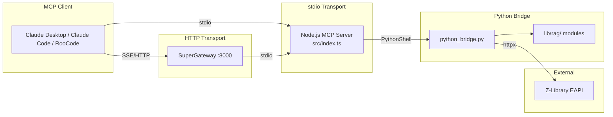

# Phase 16: Documentation & Distribution - Research

**Researched:** 2026-03-19
**Domain:** npm packaging, Docker distribution, MCP server documentation
**Confidence:** HIGH

## Summary

Phase 16 covers two distinct domains: documentation (README refresh, API docs, CONTRIBUTING.md, CHANGELOG, architecture diagram) and distribution (npm `files` whitelist, Docker verification, install path documentation). Research confirms the codebase is in good shape for both -- the existing README has strong bones to build on, the Docker setup already exists and uses SuperGateway properly, and the runtime-required files total only ~2.7MB (well under the 5MB tarball target). The critical technical challenge is the npm `files` whitelist: the current tarball packs 985 files at 117.3MB because there is no whitelist and the `.npmignore` is minimal. Adding a `files` field to `package.json` will reduce this to ~20 files totaling under 3MB compressed.

Documentation patterns are well-established: Keep a Changelog format for CHANGELOG.md, shields.io for badges, Mermaid for architecture diagrams. The API documentation scope is exactly 13 MCP tools, all with Zod schemas already defined in `src/index.ts` -- parameter types and descriptions can be extracted directly from source. The Mermaid diagram should show the stdio transport path (MCP client -> Node.js -> Python bridge -> EAPI) and the HTTP transport path (MCP client -> SuperGateway -> Node.js -> Python bridge -> EAPI).

**Primary recommendation:** Start with the npm `files` whitelist (it determines what ships and constrains everything else), verify Docker build, then write documentation that references verified install paths.

<user_constraints>

## User Constraints (from CONTEXT.md)

### Locked Decisions

**README Structure:**
- Keep existing architecture overview and recent changes sections
- Add badges at top: CI status, npm version, license
- Add `npx` quick-start usage instructions
- Add output format description (what RAG processing produces)
- Update tool count and feature list to reflect current state (13 tools)

**API Documentation Scope:**
- Document each of the 13 MCP tools
- For each: name, description, parameters (with types), return format, example usage, error cases
- Research should extract tool definitions from `src/index.ts` to determine exact parameter schemas

**CONTRIBUTING.md Scope:**
- Setup instructions (prerequisites, clone, setup-uv.sh, npm install, npm run build)
- Test instructions (npm test, uv run pytest, fast vs full)
- PR workflow (branch naming, conventional commits, lint-staged checks)
- Code patterns (reference .claude/PATTERNS.md concepts but keep standalone)
- Architecture overview (brief, link to diagram)
- Note about `.git-blame-ignore-revs` for Prettier commit

**CHANGELOG Format:**
- Follow Keep a Changelog format (keepachangelog.com)
- Entries for v1.0 (Audit Cleanup & Modernization), v1.1 (Quality & Expansion), v1.2 (Production Readiness)
- v1.0 and v1.1 summaries from milestone archives
- v1.2 will be in-progress until Phase 17 completes

### Claude's Discretion

- Exact README section ordering and heading levels
- Whether API docs go in README or separate file (research should recommend)
- CHANGELOG detail level for v1.0/v1.1 (summary vs per-phase)
- Badge service provider (shields.io, badgen, etc.)
- Whether Mermaid diagram goes inline in README or in docs/
- Exact wording of install instructions

### Deferred Ideas (OUT OF SCOPE)

- Smithery manifest for MCP registry integration (PKG-F01, v1.4+)
- postinstall script for automatic Python environment setup (PKG-F02, v1.4+)
- Multi-platform CI testing -- macOS, Windows via WSL (TEST-F01, v1.4+)
- Auto-generated TypeDoc HTML (explicitly out of scope per requirements -- hand-written API docs preferred)

</user_constraints>

## Standard Stack

### Core
| Library/Tool | Version | Purpose | Why Standard |
|-------------|---------|---------|--------------|
| npm `files` field | N/A (built-in) | Whitelist files for npm tarball | Official npm mechanism, preferred over `.npmignore` for explicit control |
| shields.io | N/A (service) | README badges (CI, npm version, license) | De facto standard for open-source badges, used by 99%+ of npm packages |
| Mermaid | N/A (GitHub-native) | Architecture diagram rendering | GitHub renders Mermaid natively in markdown -- no build step needed |
| Keep a Changelog | 1.1.0 (format spec) | CHANGELOG.md format | Industry standard, machine-parseable, human-readable |
| SuperGateway | 3.4.3 (Docker image) | HTTP transport for Docker distribution | Already in Dockerfile, provides `/health` endpoint and SSE/Streamable HTTP |

### Supporting
| Tool | Purpose | When to Use |
|------|---------|-------------|
| `npm pack --dry-run` | Verify tarball contents and size | After modifying `files` field, before any release |
| `docker compose build` | Verify Docker image builds | After any packaging changes |
| `wget --spider` | Health check verification | After Docker container starts (already in compose healthcheck) |

### Alternatives Considered
| Instead of | Could Use | Tradeoff |
|------------|-----------|----------|
| shields.io | badgen.net | badgen is slightly faster but less widely recognized; shields.io has broader badge type coverage |
| Mermaid inline | Separate SVG/PNG | SVG/PNG requires build step and asset management; Mermaid is text-based and GitHub-native |
| Keep a Changelog (manual) | conventional-changelog (auto) | Auto-generation requires strict commit conventions retrospectively; manual is better for summarizing 17 phases of existing history |

## Architecture Patterns

### Recommended Documentation Structure
```
README.md                    # Primary public-facing doc (badges, quick start, tool overview)
CONTRIBUTING.md              # Contributor guide (setup, test, PR flow)
CHANGELOG.md                 # Version history (Keep a Changelog format)
LICENSE                      # MIT license (already exists)
docs/
  api.md                     # Full API reference (13 tools with params, types, examples)
  architecture.md            # Mermaid diagram + detailed architecture description
docker/
  README.md                  # Docker-specific deployment guide (already exists, update)
```

### Pattern 1: npm `files` Whitelist for Hybrid Node.js/Python Projects
**What:** Use `package.json` `files` field to explicitly list only runtime-required files, rather than relying on `.npmignore` exclusion patterns.
**When to use:** When a project contains large dev/doc/test directories that should never ship.
**Why critical here:** Current tarball is 117.3MB / 985 files. Target is under 5MB.

**Candidate whitelist:**
```json
{
  "files": [
    "dist/",
    "lib/",
    "zlibrary/",
    "pyproject.toml",
    "uv.lock",
    "setup-uv.sh"
  ]
}
```

**What this includes (runtime-required):**
- `dist/` (208KB) -- compiled TypeScript (index.js + lib/*.js + .d.ts + .map files)
- `lib/` (1.6MB) -- Python bridge scripts and RAG processing modules
- `zlibrary/` (332KB) -- vendored Z-Library EAPI client fork
- `pyproject.toml` (3.4KB) -- Python dependency definitions for `uv sync`
- `uv.lock` (604KB) -- Reproducible Python dependency lock file
- `setup-uv.sh` (2.4KB) -- User-facing setup script

**Always included by npm (regardless of `files`):**
- `package.json` -- always included
- `README.md` -- always included (any case, any extension)
- `CHANGELOG.md` -- always included (CHANGES/CHANGELOG, any case/extension)
- `LICENSE` -- always included

**Total estimated uncompressed:** ~2.7MB + always-included files ~15KB = ~2.72MB
**Expected compressed tarball:** well under 5MB (compression ratio ~40-60% for text)

**What this excludes (985 -> ~20 files):**
- `.planning/` (189 files) -- GSD planning artifacts
- `claudedocs/` (170 files) -- session notes, archives
- `.claude/` (170 files) -- AI assistant configuration
- `docs/` (83 files) -- ADRs, specs (not needed at runtime)
- `__tests__/` (71 files) -- test suites
- `test_files/` (55 files) -- test fixtures, ground truth
- `scripts/` (50 files) -- development/validation scripts
- `coverage/` (22 files) -- coverage reports
- `src/` (13 files) -- TypeScript source (consumers use dist/)
- `docker/` (4 files) -- Docker-specific files (not needed for npm install)

### Pattern 2: Separate API Docs File
**What:** Place detailed API reference in `docs/api.md` rather than inline in README.
**Why:** 13 tools with full parameter tables, types, examples, and error cases would make README ~500+ lines longer. README should stay under 300 lines for scannability.
**Recommendation:** README includes a tool overview table (name + one-line description) with a link to `docs/api.md` for full details. This matches the existing README pattern.

### Pattern 3: Mermaid Architecture Diagram
**What:** Use Mermaid flowchart syntax for the architecture diagram.
**Why:** GitHub renders Mermaid natively. No image files to maintain. Text-based, so it diffs properly in git.
**Recommendation:** Place the diagram in README directly (it is small enough) rather than a separate file. The CONTEXT.md requirement (DOCS-04) specifically calls for "a Mermaid architecture diagram" -- embedding it in README makes it immediately visible.

### Pattern 4: Dual Install Path Documentation
**What:** Document both npm (stdio) and Docker (HTTP) install paths with step-by-step instructions.
**Why:** These are fundamentally different user journeys:
- npm path: clone -> setup Python -> build -> configure MCP client for stdio transport
- Docker path: clone -> docker compose up -> configure MCP client for HTTP transport

**Key difference:** The MCP client configuration JSON is different for each path:
- npm/stdio: `"command": "node", "args": ["/path/to/dist/index.js"]`
- Docker/HTTP: `"url": "http://localhost:8000/sse"` (SuperGateway SSE transport)

### Anti-Patterns to Avoid
- **Monolithic README:** Putting everything in README makes it unreadable. Keep README as an overview + quick start; detailed docs go in `docs/` or `CONTRIBUTING.md`.
- **Undocumented env vars:** Z-Library credentials are required but easy to forget. The credential validation added in Phase 15 helps, but docs must explain env var setup for both paths.
- **Stale tool counts:** README says "13 MCP Tools" -- this must match actual tool registrations in `src/index.ts`. Phase 17 will add CI validation for this.

## Don't Hand-Roll

| Problem | Don't Build | Use Instead | Why |
|---------|-------------|-------------|-----|
| README badges | Custom SVG/HTML badges | shields.io service URLs | Shields.io auto-updates from npm registry and GitHub, always current |
| Architecture diagrams | Static image files | Mermaid code blocks | GitHub renders natively, no build step, text-based diffs |
| Changelog format | Custom changelog format | Keep a Changelog 1.1.0 | Standardized, machine-parseable, widely recognized |
| npm tarball filtering | Complex `.npmignore` patterns | `files` field whitelist | Whitelist is simpler and safer than blacklist for excluding 965+ files |
| HTTP transport for Docker | Custom HTTP wrapper | SuperGateway (already used) | Battle-tested stdio-to-HTTP bridge with health endpoint, already configured |

**Key insight:** All documentation and packaging problems in this phase have well-established solutions. The risk is not in choosing wrong tools -- it is in misconfiguring the whitelist or writing docs that don't match the actual install experience.

## Common Pitfalls

### Pitfall 1: npm `files` Whitelist Missing Runtime Dependencies
**What goes wrong:** The tarball ships without Python files (`lib/`, `zlibrary/`) or Python environment definitions (`pyproject.toml`, `uv.lock`), so the server fails at runtime.
**Why it happens:** Standard Node.js projects only need `dist/`. This hybrid project also needs Python runtime files.
**How to avoid:** Always verify with `npm pack --dry-run` after changing `files`. Check that `lib/python_bridge.py` appears in the output.
**Warning signs:** Tarball under 500KB (suspiciously small -- means Python files are missing).

### Pitfall 2: npm `files` Whitelist Including `__pycache__/`
**What goes wrong:** `lib/` contains `__pycache__/` directories with `.pyc` compiled bytecode that is platform-specific.
**Why it happens:** The `files` whitelist includes `lib/` which contains `__pycache__/` subdirectories.
**How to avoid:** Add `__pycache__` to `.npmignore`. The `.npmignore` is still consulted for files within whitelisted directories. Current `.npmignore` already has `__pycache__/` -- verify this works.
**Warning signs:** `.pyc` files appearing in `npm pack --dry-run` output.

### Pitfall 3: Docker Build Context Too Large
**What goes wrong:** `docker compose build` is slow because the build context sends all 985+ files to the Docker daemon.
**Why it happens:** Docker sends everything not in `.dockerignore` as build context.
**How to avoid:** Verify `.dockerignore` exists and excludes test files, docs, `.planning/`, etc. The Dockerfile uses multi-stage build which helps, but a large context still slows the initial `COPY`.
**Warning signs:** Build takes >2 minutes where the first step is "Sending build context."

### Pitfall 4: Badge URLs Break on Unpublished npm Package
**What goes wrong:** The npm version badge returns a 404 or "package not found" error because the package has not been published to npm yet.
**Why it happens:** shields.io queries the npm registry. If `zlibrary-mcp` is not published, the badge fails.
**How to avoid:** Phase 17 handles npm publish workflow. Until then, use a static badge or omit the npm version badge. CI badge (GitHub Actions) works immediately. License badge works from GitHub metadata.
**Warning signs:** Broken badge image in README preview.

### Pitfall 5: Mermaid Diagram Not Rendering on GitHub
**What goes wrong:** Mermaid code block renders as plain text instead of a diagram.
**Why it happens:** Using wrong fenced code block syntax or unsupported Mermaid features.
**How to avoid:** Use ````mermaid` code fence (not ````mermaid-js` or other variants). Test by viewing the file on GitHub after pushing. Keep diagrams simple -- GitHub's Mermaid renderer supports a subset of full Mermaid.
**Warning signs:** Diagram shows as code on GitHub (works fine in VS Code preview).

### Pitfall 6: Docker Compose Build Path Confusion
**What goes wrong:** `docker compose -f docker/docker-compose.yaml build` fails because the build context is wrong.
**Why it happens:** The compose file uses `context: ..` (parent directory) but the file itself is in `docker/`. Running from the wrong directory changes what `..` resolves to.
**How to avoid:** Always run from project root: `docker compose -f docker/docker-compose.yaml build`. The compose file already has `context: ..` and `dockerfile: docker/Dockerfile` which is correct when run from project root.
**Warning signs:** `COPY` commands in Dockerfile fail with "file not found."

### Pitfall 7: SuperGateway Health Endpoint vs Streamable HTTP
**What goes wrong:** Documenting the wrong MCP client configuration for Docker users.
**Why it happens:** SuperGateway exposes multiple endpoints: `/health` (HTTP GET, returns "ok"), `/sse` (SSE transport), `/mcp` (Streamable HTTP). MCP clients need the transport endpoint, not the health endpoint.
**How to avoid:** Document the correct client configuration for each MCP client:
- Claude Desktop (SSE): configure with `url: "http://localhost:8000/sse"`
- Claude Desktop (Streamable HTTP): may need `url: "http://localhost:8000/mcp"`
- The Docker compose command doesn't specify `--streamableHttp`, so SSE is the default transport.
**Warning signs:** MCP client connects but gets "not found" or empty responses.

## Code Examples

Verified patterns from project source and official documentation:

### npm `files` Whitelist Configuration
```json
// Source: npm docs (https://docs.npmjs.com/cli/v11/configuring-npm/package-json)
// In package.json:
{
  "files": [
    "dist/",
    "lib/",
    "zlibrary/",
    "pyproject.toml",
    "uv.lock",
    "setup-uv.sh"
  ]
}
```

### Shields.io Badge Markdown
```markdown
<!-- Source: https://shields.io/ -->
<!-- CI badge -- uses workflow file name -->
[](https://github.com/loganrooks/zlibrary-mcp/actions/workflows/ci.yml)

<!-- npm version badge -- will 404 until npm publish in Phase 17 -->
[](https://www.npmjs.com/package/zlibrary-mcp)

<!-- License badge -- reads from GitHub repo metadata -->
[](https://github.com/loganrooks/zlibrary-mcp/blob/master/LICENSE)
```

### Mermaid Architecture Diagram


### Keep a Changelog Header Format
```markdown
<!-- Source: https://keepachangelog.com/en/1.1.0/ -->
# Changelog

All notable changes to this project will be documented in this file.

The format is based on [Keep a Changelog](https://keepachangelog.com/en/1.1.0/),
and this project adheres to [Semantic Versioning](https://semver.org/spec/v2.0.0.html).

## [Unreleased]

## [2.0.0] - 2026-02-01
### Added
- ...
### Changed
- ...
### Fixed
- ...
```

### Claude Desktop MCP Client Config (stdio -- npm install path)
```json
// Source: https://modelcontextprotocol.io/docs/develop/connect-local-servers
{
  "mcpServers": {
    "zlibrary": {
      "command": "node",
      "args": ["/absolute/path/to/zlibrary-mcp/dist/index.js"],
      "env": {
        "ZLIBRARY_EMAIL": "your-email@example.com",
        "ZLIBRARY_PASSWORD": "your-password"
      }
    }
  }
}
```

### Claude Code MCP Config (stdio -- npm install path)
```json
// In .mcp.json at project root:
{
  "mcpServers": {
    "zlibrary": {
      "command": "node",
      "args": ["/absolute/path/to/zlibrary-mcp/dist/index.js"],
      "env": {
        "ZLIBRARY_EMAIL": "your-email@example.com",
        "ZLIBRARY_PASSWORD": "your-password"
      }
    }
  }
}
```

### Docker MCP Client Config (HTTP -- Docker install path)
```json
// Source: SuperGateway docs (https://github.com/supercorp-ai/supergateway)
// For MCP clients that support SSE transport:
{
  "mcpServers": {
    "zlibrary": {
      "command": "npx",
      "args": ["-y", "supergateway", "--sse", "http://localhost:8000/sse"]
    }
  }
}
```

### Verification: npm pack --dry-run
```bash
# After adding files whitelist, verify:
npm pack --dry-run 2>&1 | tail -10
# Expected output should show:
#   total files: ~20 (not 985)
#   package size: <3MB (not 117MB)
```

## State of the Art

| Old Approach | Current Approach | When Changed | Impact |
|--------------|------------------|--------------|--------|
| `.npmignore` blacklist | `files` whitelist in package.json | Long-standing, but increasingly preferred | Whitelist is safer for projects with many non-runtime dirs |
| Static architecture diagrams (PNG/SVG) | Mermaid in GitHub markdown | GitHub added native Mermaid support ~2022 | No image files to maintain, text-based diffs |
| SSE transport for MCP | Streamable HTTP transport | MCP specification 2025-2026 | SSE still supported but Streamable HTTP is the new default; SuperGateway supports both |
| Manual changelog | Keep a Changelog + conventional-changelog tools | Keep a Changelog 1.1.0 (stable) | Manual is fine for this project's history; auto-gen requires retrospective commit format consistency |

**Deprecated/outdated:**
- SSE transport for MCP: Still works but "support for SSE may be deprecated in the coming months" per official MCP docs. SuperGateway 3.4.3 supports both SSE and Streamable HTTP. The current Docker compose uses SSE by default (no `--streamableHttp` flag).

## Open Questions

### Resolved
- **What files should the npm `files` whitelist include?** Resolution: `dist/`, `lib/`, `zlibrary/`, `pyproject.toml`, `uv.lock`, `setup-uv.sh`. Total ~2.7MB uncompressed. npm always adds `package.json`, `README.md`, `CHANGELOG.md`, `LICENSE`.
- **Should API docs be inline in README or a separate file?** Resolution: Separate file at `docs/api.md`. 13 tools with full parameter tables would add 500+ lines to README. README keeps the overview table with link.
- **What v1.0 and v1.1 changes should appear in CHANGELOG?** Resolution: Use milestone audit summaries (v1.0-MILESTONE-AUDIT.md, v1.1-MILESTONE-AUDIT.md) as source. Summary level per milestone with key highlights, not per-phase detail. v1.0 had 28 requirements across 7 phases; v1.1 had 23 requirements across 5 phases -- bullet-point summaries of major features.
- **What HTTP transport does Docker use for MCP?** Resolution: SuperGateway 3.4.3 provides SSE transport by default. The Docker compose command specifies `--port 8000 --host 0.0.0.0 --healthEndpoint /health --stdio "node /app/dist/index.js"`. SSE endpoint is at `/sse`, message endpoint at `/message`. MCP clients connect via SSE or can use Streamable HTTP at `/mcp` if SuperGateway is configured with `--streamableHttp`.
- **Does the Docker build currently succeed?** Resolution: Cannot verify empirically (would require building the Docker image), but the Dockerfile and compose file are structurally sound. Multi-stage build copies the correct directories. Phase 15 did not change the Docker-relevant files (dist/, lib/, zlibrary/). Verification must happen during plan execution.

### Genuine Gaps
| Question | Criticality | Recommendation |
|----------|-------------|----------------|
| Will npm version badge work before npm publish? | Low | Use static badge or omit until Phase 17 npm publish. CI and license badges work immediately. |
| Does SuperGateway SSE transport work with current Claude Desktop? | Medium | Document SSE config first (known working), note Streamable HTTP as alternative. Phase 17 E2E test will validate. |
| Are `__pycache__/` dirs excluded from tarball despite `lib/` in `files`? | Medium | Current `.npmignore` has `__pycache__/` which should filter within whitelisted dirs. Verify with `npm pack --dry-run` during execution. |

### Still Open
- Whether `.dockerignore` exists and is comprehensive (not checked -- executor should verify and create/update if needed)

## Sources

### Primary (HIGH confidence)
- `src/index.ts` -- all 13 MCP tool registrations with Zod schemas and descriptions (read directly)
- `package.json` -- current package configuration, dependencies, scripts (read directly)
- `docker/Dockerfile` -- multi-stage build using SuperGateway 3.4.3 (read directly)
- `docker/docker-compose.yaml` -- compose configuration with health check (read directly)
- `.planning/milestones/v1.0-MILESTONE-AUDIT.md` -- v1.0 milestone summary (28/28 requirements, 7 phases)
- `.planning/milestones/v1.1-MILESTONE-AUDIT.md` -- v1.1 milestone summary (23/23 requirements, 5 phases)
- `npm pack --dry-run` output -- 985 files, 117.3MB, confirmed no `files` field
- `du -sh` measurements -- dist/ 208KB, lib/ 1.6MB, zlibrary/ 332KB, total ~2.7MB

### Secondary (MEDIUM confidence)
- [npm package.json docs](https://docs.npmjs.com/cli/v11/configuring-npm/package-json/) -- `files` field behavior
- [npm cli wiki: Files & Ignores](https://github.com/npm/cli/wiki/Files-&-Ignores) -- interaction between `files` and `.npmignore`
- [Keep a Changelog 1.1.0](https://keepachangelog.com/en/1.1.0/) -- changelog format specification
- [SuperGateway GitHub](https://github.com/supercorp-ai/supergateway) -- Docker image, transport options, health endpoints
- [MCP local server connection docs](https://modelcontextprotocol.io/docs/develop/connect-local-servers) -- Claude Desktop client configuration format
- [shields.io](https://shields.io/) -- badge URL patterns for npm version, CI status, license

### Tertiary (LOW confidence)
- [Claude Help Center: Remote MCP servers](https://support.claude.com/en/articles/11503834-building-custom-connectors-via-remote-mcp-servers) -- Streamable HTTP transport for Claude Desktop (transport may evolve)
- [Speakeasy: Distributing MCP servers](https://www.speakeasy.com/mcp/distributing-mcp-servers) -- general MCP distribution guidance

## Metadata

**Confidence breakdown:**
- Standard stack: HIGH -- npm packaging, shields.io, Mermaid, Keep a Changelog are all mature, stable technologies with clear documentation
- Architecture: HIGH -- documentation structure patterns are well-established; the `files` whitelist contents were empirically measured from the codebase
- Pitfalls: HIGH -- pitfalls derive from direct codebase measurements (985 files, 117.3MB) and verified tool behavior (npm `files` interaction with `.npmignore`)
- Docker/SuperGateway: MEDIUM -- Dockerfile and compose are structurally verified but not empirically built/tested; SSE vs Streamable HTTP transport evolution adds minor uncertainty

**Research date:** 2026-03-19
**Valid until:** 2026-04-19 (30 days -- all technologies are stable)

## Knowledge Applied

Checked knowledge base (`~/.gsd/knowledge/index.md`), no relevant entries found for this phase's domain. The KB contains 122 signals but 0 lessons and 0 spikes. No signals are relevant to documentation, npm packaging, or Docker distribution.
