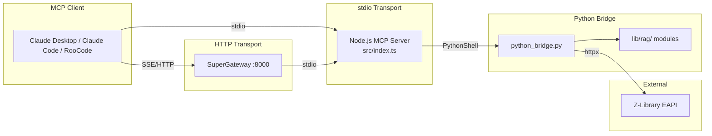

# Z-Library MCP Server

[](https://github.com/loganrooks/zlibrary-mcp/actions/workflows/ci.yml)
[](https://www.npmjs.com/package/zlibrary-mcp)
[](https://github.com/loganrooks/zlibrary-mcp/blob/master/LICENSE)

A Model Context Protocol (MCP) server that gives AI assistants -- Claude Code, Claude Desktop, RooCode, Cline -- the ability to search Z-Library, download books, and extract document content for Retrieval-Augmented Generation (RAG) workflows. Built with a Node.js/TypeScript MCP frontend and a Python bridge backend for document processing.

## Quick Start

```bash
git clone https://github.com/loganrooks/zlibrary-mcp.git
cd zlibrary-mcp
bash setup-uv.sh && npm install && npm run build
```

Then add to your MCP client config (Claude Code `.mcp.json`, Claude Desktop `claude_desktop_config.json`):

```json
{
  "mcpServers": {
    "zlibrary": {
      "command": "node",
      "args": ["/absolute/path/to/zlibrary-mcp/dist/index.js"],
      "env": {
        "ZLIBRARY_EMAIL": "your-email@example.com",
        "ZLIBRARY_PASSWORD": "your-password"
      }
    }
  }
}
```

## Architecture Overview



- **Node.js/TypeScript MCP Server**: 13 tools registered via McpServer `server.tool()` API (MCP SDK 1.25+)
- **Python Bridge**: Z-Library EAPI client (httpx) + document processing (lib/rag/ modules)
- **EAPI Transport**: JSON API endpoints at `/eapi/` bypass Cloudflare browser challenges
- **UV-Based Python Environment**: Project-local `.venv/` with `uv.lock` for reproducible builds
- **Vendored Z-Library Fork**: Custom EAPI client for search and file downloads
- **RAG Pipeline**: EPUB/PDF/TXT extraction with quality detection, output to files (not memory)

## Available MCP Tools (13 Total)

### Search Tools (7)

| Tool | Description |
|------|-------------|
| `search_books` | Basic search by keyword with filters |
| `full_text_search` | Search within book contents |
| `search_by_term` | Conceptual navigation via terms |
| `search_by_author` | Advanced author search |
| `search_advanced` | Fuzzy match detection with separate exact/fuzzy results |
| `search_multi_source` | Parallel search across multiple sources |
| `get_recent_books` | Recently added books |

### Metadata Tools (1)

| Tool | Description |
|------|-------------|
| `get_book_metadata` | Complete metadata extraction (terms, descriptions, ratings) |

### Collection Tools (1)

| Tool | Description |
|------|-------------|
| `fetch_booklist` | Expert-curated collection contents |

### Download & Processing Tools (2)

| Tool | Description |
|------|-------------|
| `download_book_to_file` | Download with optional RAG processing |
| `process_document_for_rag` | Extract text from EPUB/PDF/TXT |

### Utility Tools (2)

| Tool | Description |
|------|-------------|
| `get_download_limits` | Check daily download quota |
| `get_download_history` | View recent downloads |

For complete parameter documentation, types, and examples, see [API Reference](docs/api.md).

## Installation

### Option A: Local Installation (stdio transport)

**Prerequisites:** Node.js 22+, Python 3.10+, [UV](https://docs.astral.sh/uv/)

```bash
# 1. Install UV (one-time, if not already installed)
curl -LsSf https://astral.sh/uv/install.sh | sh

# 2. Clone and build
git clone https://github.com/loganrooks/zlibrary-mcp.git
cd zlibrary-mcp
bash setup-uv.sh    # Creates .venv/ and installs Python dependencies
npm install          # Installs Node.js dependencies
npm run build        # Compiles TypeScript to dist/
```

**MCP client configuration (stdio transport):**

Claude Code (`.mcp.json` in your project root):

```json
{
  "mcpServers": {
    "zlibrary": {
      "command": "node",
      "args": ["/absolute/path/to/zlibrary-mcp/dist/index.js"],
      "env": {
        "ZLIBRARY_EMAIL": "your-email@example.com",
        "ZLIBRARY_PASSWORD": "your-password"
      }
    }
  }
}
```

RooCode / Cline (`mcp_settings.json`):

```json
{
  "mcpServers": {
    "zlibrary-local": {
      "command": "node",
      "args": ["/absolute/path/to/zlibrary-mcp/dist/index.js"],
      "env": {
        "ZLIBRARY_EMAIL": "your-email@example.com",
        "ZLIBRARY_PASSWORD": "your-password"
      },
      "transport": "stdio",
      "enabled": true
    }
  }
}
```

### Option B: Docker (HTTP transport)

**Prerequisites:** Docker and Docker Compose

```bash
# 1. Clone the repository
git clone https://github.com/loganrooks/zlibrary-mcp.git
cd zlibrary-mcp

# 2. Configure credentials
cp docker/env.example docker/.env
# Edit docker/.env with your Z-Library email and password

# 3. Build and start the container
docker compose -f docker/docker-compose.yaml up -d
```

The server will be available at `http://localhost:8000`. Verify with:

```bash
curl http://localhost:8000/health
```

**MCP client configuration (SSE/HTTP transport):**

```json
{
  "mcpServers": {
    "zlibrary": {
      "command": "npx",
      "args": ["-y", "supergateway", "--sse", "http://localhost:8000/sse"]
    }
  }
}
```

## Output Format (RAG Processing)

The RAG pipeline processes downloaded documents (EPUB, PDF, TXT) into clean text files for use in retrieval-augmented generation workflows.

- **Output location:** Processed text files are saved to `./processed_rag_output/`
- **File-based output:** Tools return file paths rather than raw text content, avoiding context overflow in AI assistants
- **Supported formats:** EPUB, PDF, and TXT
- **Quality detection:** The pipeline automatically detects document quality (OCR vs. digital text) and applies appropriate extraction strategies
- **Scholarly formatting:** Preserves footnotes, chapter structure, and academic formatting where possible

Use `download_book_to_file` with `process_for_rag: true` for combined download and processing, or `process_document_for_rag` to process an existing file.

## Configuration

The server requires Z-Library credentials, set as environment variables:

| Variable | Required | Description |
|----------|----------|-------------|
| `ZLIBRARY_EMAIL` | Yes | Z-Library account email |
| `ZLIBRARY_PASSWORD` | Yes | Z-Library account password |
| `ZLIBRARY_MIRROR` | No | Custom Z-Library mirror URL |

The server validates credentials at startup and emits a clear error if they are missing.

### Retry and Circuit Breaker

All API operations include automatic retry with exponential backoff and circuit breaker protection. These are configurable via environment variables:

| Variable | Default | Description |
|----------|---------|-------------|
| `RETRY_MAX_RETRIES` | `3` | Maximum retry attempts |
| `RETRY_INITIAL_DELAY` | `1000` | Initial retry delay (ms) |
| `RETRY_MAX_DELAY` | `30000` | Maximum retry delay (ms) |
| `RETRY_FACTOR` | `2` | Exponential backoff multiplier |
| `CIRCUIT_BREAKER_THRESHOLD` | `5` | Failures before opening circuit |
| `CIRCUIT_BREAKER_TIMEOUT` | `60000` | Time (ms) before retry after circuit opens |

See [docs/RETRY_CONFIGURATION.md](docs/RETRY_CONFIGURATION.md) for details.

## Development

### Running Tests

```bash
# Run all tests (Jest for Node.js + Pytest for Python)
npm test

# Python tests only
uv run pytest

# Specific Python test
uv run pytest __tests__/python/test_rag_processing.py
```

### Building

```bash
npm run build
```

## FAQ

### Why EAPI instead of HTML scraping?

Z-Library deployed Cloudflare browser challenges (Jan 2026) that block all HTML page requests from automated clients. The EAPI JSON endpoints at `/eapi/` are not subject to these challenges, providing reliable programmatic access. See `docs/adr/ADR-005-EAPI-Migration.md`.

### Why use `node` in .mcp.json instead of `uv`?

The MCP server is a Node.js application. UV is only used during setup (`uv sync`) to create `.venv/` and install Python dependencies. At runtime, Node.js runs the MCP server which calls `.venv/bin/python` internally.

```
Setup:  uv sync --> creates .venv/
Build:  npm run build --> compiles TypeScript to dist/
Runtime: node dist/index.js --> runs MCP server --> calls .venv/bin/python internally
```

### What if I move the project directory?

No problem. `.venv/` moves with the project (UV creates project-local environments).

## Contributing

Contributions are welcome! See [CONTRIBUTING.md](CONTRIBUTING.md) for setup instructions, code style, testing, and PR workflow.

## License

This project is licensed under the MIT License - see the LICENSE file for details.

## Disclaimer

This tool is provided for educational and research purposes only. Users are responsible for complying with all applicable laws and regulations regarding the downloading and use of copyrighted materials. Accessing Z-Library may be restricted in certain jurisdictions.
